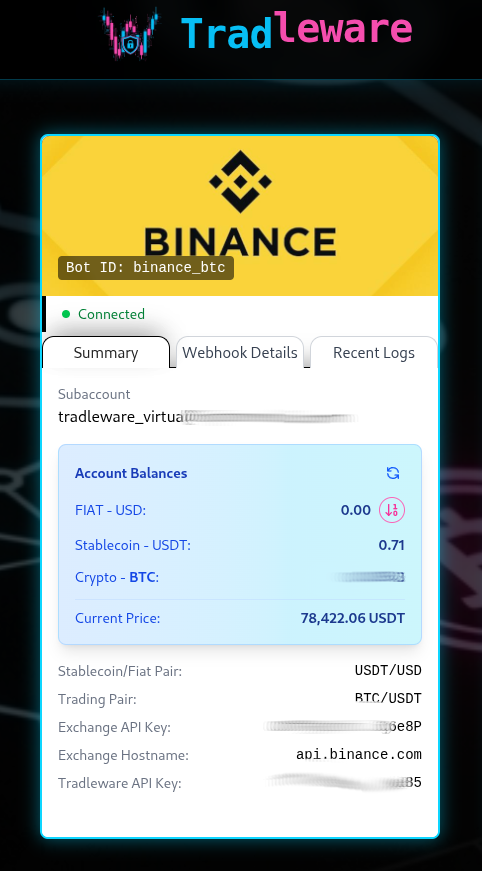
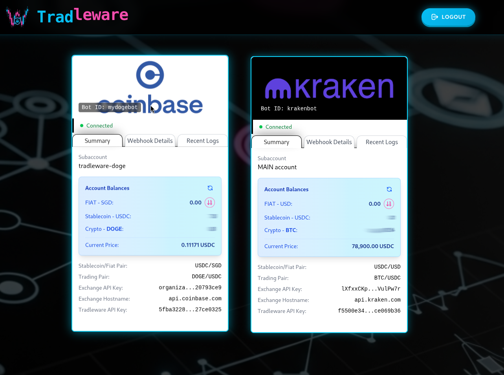
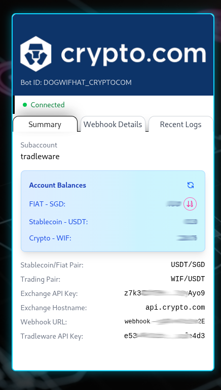
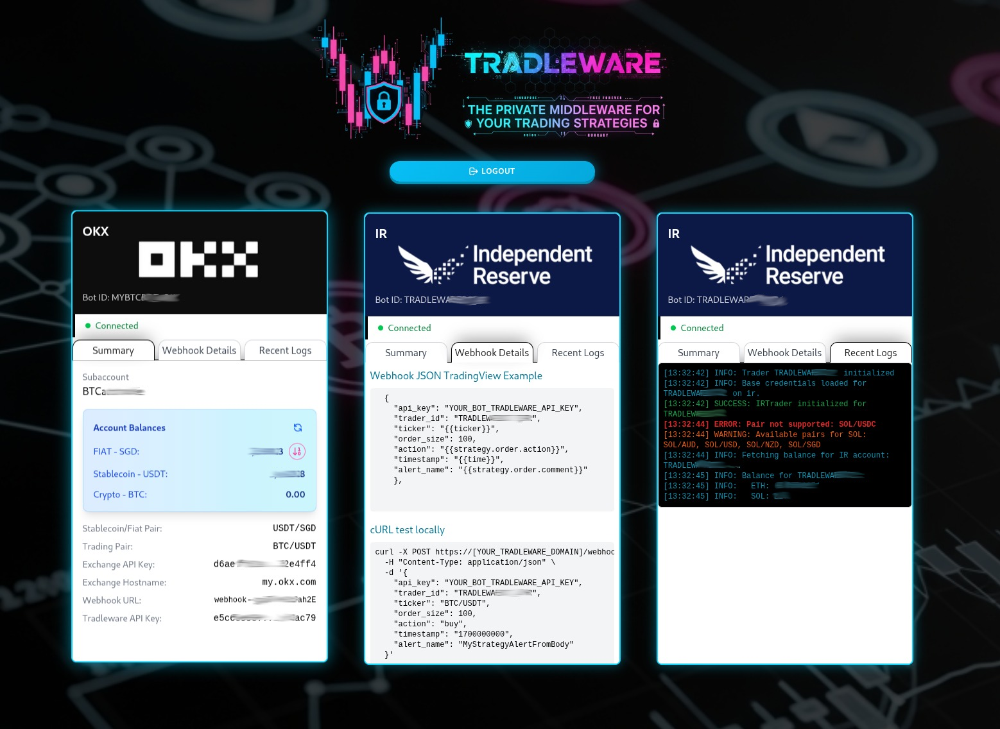
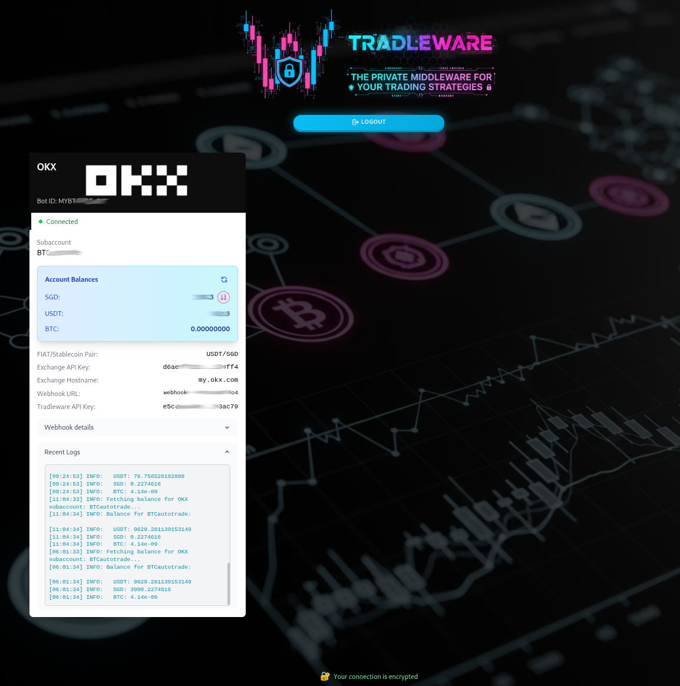

# Changelog

All notable changes to Tradleware will be documented in this file.

The format is based on [Keep a Changelog](https://keepachangelog.com/en/1.0.0/),
and this project adheres to [Semantic Versioning](https://semver.org/spec/v2.0.0.html).

## [v3.5.0b] - 2026-08-29

Signals can now be sized in cash — "invest 300" — instead of a percentage or an exact
quantity. Stock bots also stop assuming a US-listed, USD-denominated instrument. Every
new setting defaults to the previous behaviour, so existing bots are unaffected.

### Added

- **Cash-denominated order sizing** — `order_size_type: "cash"` makes `order_size` an
  amount of the currency you pay with: your account currency for stocks, the pair's quote
  currency for crypto. The same payload works on either, so a signal never needs to know
  which broker it reaches. **Buy only** — use `percentage` with `100` to close a position.
  This is what recurring DCA wants: the amount stays fixed rather than following the
  balance.
  - Without `fractional_shares: true`, stock orders truncate to whole shares and log what
    was left undeployed. Unlike percentage sizing this does not catch up on its own, so
    enable fractional shares where the instrument supports it.
  - Crypto amounts are checked against the pair's quote balance and the exchange's
    minimum notional, naming the limit rather than letting the venue reject the order.
- **`account_currency`** (default `USD`) for stock bots — which cash balance orders are
  sized against. IBKR reports one figure per currency an account holds; this names the one
  to use, and says which currencies *were* reported if the configured one is absent.
- **`trading_currency`** (defaults to `account_currency`), **`exchange`** (default
  `SMART`) and **`primary_exchange`** — contract routing. `SMART` suits US listings and is
  ambiguous for a ticker cross-listed on several European venues in different currencies.

### Changed

- Explicit share counts are now checked against available cash or the position held
  before the order is sent. Selling more than is held is refused rather than passed to the
  broker, where a margin-enabled account would open a short for the excess.
- Bot card logs drop internal `[LAYER n]` prefixes; they remain at DEBUG level.
- Cash figures in stock logs show the account's currency instead of a `$` prefix.
- The dashboard log pane keeps your scroll position instead of jumping to the newest entry
  every refresh.

### Fixed

- **Market-hours settings in stock bot configs now take effect.** `market_timezone`,
  `market_open`, `market_close`, `pre_market_open` and `after_hours_close` were documented
  and read by the trader but never reached it — a bot on a non-US venue ran on NYSE hours,
  refusing to trade during its own session and trading outside it.
- **A crypto bot config that omits the optional `hostname` line now loads.** It previously
  failed with an error that stopped the whole file, taking every other bot in it along.
  The shipped examples all set `hostname: ""` explicitly, so only hand-written configs
  that left the line out were affected.
- Static assets are versioned, so a released fix reaches the browser instead of sitting
  behind a cached copy of the previous one.

---

## [v3.4.2b] - 2026-08-25

### Added

- **Bot card logs are dated.** A `── YYYY-MM-DD ──` divider appears above the first entry
  and again whenever the day changes, so a line is no longer ambiguous about which day it
  belongs to. Times still appear on every row.

### Changed

- **Webhook examples show the bot's own trading pair.** Each bot's Webhook Details pane
  now prints the configured pair (`BTC/USDC`, `VWCE`) in the `ticker` field instead of
  TradingView's `{{ticker}}` placeholder, which expands to the venue-native spelling and
  did not match. Copy the example as-is and it works.
- **Ticker spelling is tolerated.** A `ticker` that differs from the configured pair only
  by separators or case — `BTCUSDC`, `btc-usdc`, `BTC_USDC` — is accepted, logged as a
  warning, and treated as the configured pair. A different instrument is still rejected,
  and perpetuals never match their spot pair.

### Security

- Log text is HTML-escaped before it is rendered in the dashboard.

---

## [v3.4.1b] - 2026-08-20

### Fixed

- **Dashboard CSS, images and JavaScript failed to load when accessed through an HTTPS
  reverse proxy.** Static assets were referenced with absolute URLs built from the scheme
  the application saw, which is plain HTTP behind a TLS-terminating proxy — so a browser
  on an HTTPS page blocked every one of them as mixed content. They are now root-relative
  and inherit the page's own scheme. Affects v3.4.0b only.

---

## [v3.4.0b] - 2026-08-20

Security hardening release. Upgrading is recommended for all users.

### ⚠️ Breaking changes

1. **`TRUSTED_PROXIES` must be set when running behind a reverse proxy or tunnel** (nginx,
   Caddy, Traefik, Cloudflare Tunnel). Forwarded headers are only honoured from addresses
   listed there. Leave it empty in a proxied setup and webhooks are rejected, and
   trusted-IP dashboard access stops working. Use the address Tradleware sees the proxy
   connect from — for Docker, the proxy container's IP or its bridge subnet.
2. **TradingView alerts must send `{{timenow}}` instead of `{{time}}`.** Signals require a
   current timestamp; `{{time}}` is the bar time and will be rejected on higher timeframes.
   Each bot's Webhook Details pane shows the updated example.
3. **Dashboard login requires HTTPS.** Trusted-IP access is unaffected, so a Raspberry Pi
   kiosk on `TRUSTED_IPS` keeps working. Set `SESSION_HTTPS_ONLY=false` for LAN-only setups
   with no TLS. Existing sessions are invalidated on upgrade.

### Security

- Forwarded headers (`X-Forwarded-For`, `X-Real-IP`, `X-Forwarded-Proto`) are honoured only
  from addresses in `TRUSTED_PROXIES`, taking the rightmost non-proxy hop.
- Webhooks require TLS (`WEBHOOK_REQUIRE_HTTPS`), and signals must carry a current timestamp
  and are accepted only once — persisted across restarts.
- Trade execution is serialised per bot, so concurrent signals cannot size orders from the
  same pre-trade balance. Different bots continue to run in parallel.
- Credentials are excluded from logs and notifications; dashboard API keys are masked to a
  fixed-width mask plus a 4-character suffix.
- Session cookie carries `Secure` with a 12-hour lifetime.
- Credential comparison is constant-time.
- State-changing dashboard requests require an `X-Tradleware-Request` header.
- Repeated webhook rejections are collapsed into periodic summaries, and repeated failed
  authentications from one address are throttled.
- Notification delivery moved to a background thread, so a slow notification server no
  longer delays request handling.

### New Features

- **Test suite** — 344 tests, offline and deterministic; no exchange is contacted.
  `pip install -r requirements-dev.txt && pytest`
- **Webhook API key strength check** — each bot's key is graded at startup and on the
  dashboard by length, character variety, reuse across bots, and whether it is still a
  placeholder from the `.yaml.example` files. Advisory only; never blocks a bot.
- **Default webhook path warning** — a dashboard banner with the generation command when
  `WEBHOOK_PATH` is left unchanged. Advisory only.
- **Log rotation with gzip compression** — `LOG_MAX_BYTES`, `LOG_BACKUP_COUNT`,
  `LOG_COMPRESS_ROTATED`. Roughly a 16 MB ceiling; the active log stays uncompressed.

### Improvements

- `.env.example` reorganised: settings you should change, optional settings, then a
  security section whose defaults need no tuning as you add bots.
- Signal timestamps are normalised to UTC on parse.
- Documented the NTP requirement for timestamp checks, the Docker gateway address for
  `TRUSTED_IPS`, and `--no-proxy-headers` for local runs.

### New Configuration

All optional with safe defaults: `TRUSTED_PROXIES`, `WEBHOOK_REQUIRE_HTTPS`,
`WEBHOOK_MAX_AGE_S`, `WEBHOOK_REPLAY_DB`, `WEBHOOK_FAILURE_LIMIT`,
`WEBHOOK_FAILURE_WINDOW_S`, `WEBHOOK_REJECTION_SUMMARY_S`, `TRADER_LOCK_TIMEOUT_S`,
`SESSION_HTTPS_ONLY`, `SESSION_MAX_AGE_S`, `LOG_MAX_BYTES`, `LOG_BACKUP_COUNT`,
`LOG_COMPRESS_ROTATED`, `UPDATE_CHECK_INTERVAL_S`.

---

## [v3.3.2b] - 2026-06-02

### Security
- **CVE-2026-48710 (BadHost) assessment** — confirmed Tradleware is not directly exploitable (no custom `BaseHTTPMiddleware` using `request.url.path` for access control; auth is route-level via session). Upgraded as a precaution.
- **Starlette 0.52.1 → 1.2.1** — pulls in Host header validation per RFC 9112/3986.
- **FastAPI 0.129.0 → 0.136.3** — updated alongside Starlette (tightly coupled dependency).
- **`src/requirement.txt`** — pinned `fastapi>=0.136.3`; added explicit `starlette>=1.0.1` minimum constraint.

---

## [v3.3.1b] - 2026-05-23

### Improvements
- Webhook handler now accepts TradingView 'long'/'short' as 'buy'/'sell' (normalized for all bots).
- README and docs now strongly emphasize that the `ticker` field in webhook payloads must match the bot's `crypto_stablecoin_pair` (e.g., `BTC/USDT`), not a generic ticker or space-separated format. Added warning for TradingView users.

## [v3.3.0b] - 2026-05-16

  

### New Features
- **Binance exchange integration** — full `BinanceTrader` implementation using CCXT. Supports market and maker-limit orders, percentage-based and fixed-quantity order sizing, fiat→stablecoin conversion, open order listing, and per-bot `bot_configs/crypto/binance.yaml` configuration. Uses standard API key + secret key (HMAC-SHA256) authentication — no passphrase required. Subaccounts are supported by creating API keys under each Binance subaccount and configuring them as separate bots; `subaccount_name` is a display-only label for the dashboard. Binance.US users can set `hostname: api.binance.us`.

---

## [v3.2.0b] - 2026-05-16

  

### New Features
- **Kraken Pro exchange integration** — full `KrakenTrader` implementation using CCXT. Supports market and maker-limit orders, percentage-based and fixed-quantity order sizing, fiat→stablecoin conversion, open order listing, and per-bot `bot_configs/crypto/kraken.yaml` configuration. Uses standard API key + private key (base64) authentication — no passphrase required.

### Improvements
- **Hostname now always populated** — all crypto traders (`OKX`, `Crypto.com`, `IR`, `Coinbase`, `Kraken`) resolve their exchange hostname to a concrete default (e.g. `api.kraken.com`, `okx.com`) if the YAML field is left empty. The resolved hostname is now visible on the bot card in the dashboard.
- **`hostname` field made optional in bot YAML** — removed from the `_CRYPTO_REQUIRED` validation set in `config_loader.py`. Leaving `hostname` blank (or omitting it entirely) is now valid; each trader falls back to its exchange default automatically.
- **Return type annotations** — all five crypto trader classes now have explicit return type annotations on `create_order`, `cancel_order`, `fetch_open_orders`, `list_fiat_markets`, and `convert_fiat_to_stablecoin`.

---

## [v3.1.0b] - 2026-05-09

### New Features
- **Coinbase Advanced Trade integration** — full `CoinbaseTrader` implementation using CCXT with Coinbase CDP (Cloud Developer Platform) API keys. Supports market buys/sells, percentage-based and fixed-quantity orders, fiat→stablecoin conversion, and the 4-layer order pattern. CDP key format (`organizations/...`) is handled automatically by CCXT via ES256 JWT signing.
- **Maker-limit buy override for limit-only pairs** — `CoinbaseTrader` overrides `_get_maker_buy_price` to price limit orders at the **ask** (not bid), so they fill immediately on exchanges that enforce limit-only mode (e.g. USDC/SGD on Coinbase). This provides market-equivalent execution without requiring market order support.
- **Per-trader `convert_fiat_to_stablecoin` strategy** — removed the hardcoded `order_execution_strategy='market'` from the dashboard's convert endpoint. Each trader now uses its own default (Coinbase defaults to `maker_limit`; OKX, Crypto.com, and IR continue to use `market`).

### Improvements
- **Bot ID label readability** — the Bot ID pill on dashboard exchange card headers now uses a dark semi-transparent background with blur so it remains legible against any exchange logo image.
- **Coinbase logo** added to exchange logo assets.
- **Version hidden from login page** — `TRADLEWARE_VERSION` is no longer displayed on the unauthenticated login page to prevent version fingerprinting by unauthenticated visitors. The version remains visible in the authenticated dashboard footer.

---

## [v3.0.7b] - 2026-05-07

### New Features
- **Update availability indicator** — a background task (`_update_check_loop`) polls the GitHub Tags API (`https://api.github.com/repos/cslev/tradleware/tags`) once at startup and then every 6 hours (configurable via `UPDATE_CHECK_INTERVAL_S` in `.env`). The dashboard footer now shows a pulsing neon-magenta **"⬆ Update available: vX.X.X"** badge when a newer version tag exists on GitHub, or a static green **"✔ Up to date!"** indicator when the running version is current. No Gotify notification — visual only.

### Improvements
- **Dashboard green color unified** — all status-text greens in `index.html` normalised to `text-green-300` / `#86efac` (connection encrypted, trusted IP, server public IP lines).

---

## [v3.0.6b] - 2026-04-27

### Improvements
- **Webhook received log** — a new `INFO` log line is emitted at the very start of webhook processing, before any validation, showing `trader_id`, `action`, and `ticker`. This makes it immediately visible in logs what was sent even when a request fails validation (e.g. wrong `trader_id`).

---

## [v3.0.5b] - 2026-04-25

### Bug Fixes
- **IBKR duplicate error handler registrations** — `connect()` was called repeatedly (on startup, by the health-check loop on reconnect, and by `fetch_positions`/`create_order` internally), each time adding a new `_on_error` handler via `+=` without removing the old one. With N reconnect attempts, N handlers accumulated on `ib.errorEvent`, causing every IB error event (e.g. error 1100, 2106) to fire N identical log lines and N Gotify notifications simultaneously. Fixed by always doing `self.ib.errorEvent -= self._on_error` before `+= self._on_error` in `connect()`, ensuring exactly one handler registration at all times.

---

## [v3.0.4b] - 2026-04-20

### Bug Fixes
- **IBKR 1101/1102 double log on reconnect** — error codes `1101` (connectivity restored) and `1102` (briefly lost and restored) both fired on every reconnect event, generating two separate log lines. Merged into a single handler: one `success` log + `is_connected = True`. Also fixes a latent bug where `1102` previously only logged a `WARNING` without updating `is_connected`.
- **IBKR error 2150 Gotify noise** — error `2150` ("Invalid position trade derived value") fires when IB cannot compute derived P&L because market price is unavailable (e.g. during pre/post-market). Added to the debug-only informational list — no Gotify alert, no `WARNING` log.
- **Dashboard bot card expands on Webhook Details tab** — switching to the Webhook Details tab caused the card to grow wider than its container due to an unconstrained `<pre>` block. Fixed with `max-width: 100%` on `.tab-content pre` and `min-width: 0` on `.card-col`.
- **Dashboard hover glow neon top border clipped** — the `box-shadow` top glow on `.bot-card:hover` was clipped by the parent `.card-col`. Fixed by removing `overflow: hidden` from `.card-col` and adding `padding-top: 6px` to give the 4px `translateY` lift room without cropping.
- **Mobile navbar shows full brand text** — on small screens the "Tradleware" text was visible next to the logo, wasting space. Wrapped in `.navbar-brand-text` and hidden via `display: none` at ≤768px; only the logo icon is shown on mobile.

### Improvements
- **cURL example uses per-bot ticker** — the Webhook Details tab now generates the cURL example with the correct `ticker` for each bot (from a server-rendered `trader-tickers` JSON data island) instead of the hardcoded placeholder `BTC/USDT`.
- **cURL example uses real timestamp** — `timestamp` in the cURL example is now set to the actual Unix timestamp at page load (`Date.now()`), replacing the old hardcoded `1700000000`.
- **IBKR error code handler consolidated** — error code `10349` folded into the shared debug-only `elif errorCode in [...]` branch alongside `2103`–`2158` and `10167`; redundant separate branch removed.

---

## [v3.0.3b] - 2026-04-18

### New Features
- **Sticky navbar on dashboard** — a proper `<header>` element now sits above `<main>` with `position: sticky; top: 0; z-index: 50`; frosted-glass background (`rgba(0,0,0,0.85)` + `backdrop-filter: blur(12px)`); neon-cyan bottom border and glow
- **Cyberpunk brand in navbar** — "Trad" rendered in `--neon-blue`, "leware" in `--neon-pink` with `top: -0.15em` offset; Fira Code bold 2.5rem; `logo_v5.png` icon at 3.5rem left of text
- **Login page restyled** — vertical logo replaced with `logo_v5.png` icon (10rem) + same Fira Code Trad/leware brand text below it; "Welcome Back" subtitle retained

### Improvements
- Logout button enlarged (`px-6 py-3 text-sm`, `w-5 h-5` icon) and repositioned to navbar right

---

## [v3.0.2b] - 2026-04-15

### Bug Fixes
- **IBKR false order failure on TIF preset (error 10349)** — IB error 10349 ("Order TIF was set to DAY based on order preset") causes IB to internally cancel and immediately resubmit the order with TIF=DAY; the polling loop previously treated this transient `Cancelled` state as a terminal failure. Fixed: polling now inspects `trade.log` and skips the `Cancelled` state when the last logged error code is 10349, allowing the resubmitted order to fill normally.
- **Error 10349 Gotify noise** — IB error 10349 was being logged at `WARNING` level, firing a Gotify notification on every single order. Downgraded to `DEBUG` — it is purely informational and fires on every market order placed without explicit TIF.
- **fetch_positions logging pollution** — `fetch_positions()` was logging all positions across all symbols in the account (MGK, SCHD, VUSD, etc.) instead of only the symbol the bot is configured for. Now only logs the position for the configured symbol.

### New Features
- **IBKR auto-reconnect on connection drop** — the IBKR health-check loop now automatically calls `trader.connect()` when a connection is found to be down, instead of only notifying the user to reconnect via the dashboard. Sends a Gotify success notification on successful auto-reconnect, or a Gotify error notification if reconnect fails (retry on next health-check cycle).

### Improvements
- **Order failure reason surfaced** — when an IBKR order is rejected or cancelled for a non-10349 reason, the IB error code and message are now included in the `RuntimeError` raised to the webhook caller (e.g. `"Reason: [201] Order rejected - Insufficient funds"`), making it easier to diagnose the root cause.
- **pylint**: 10.00/10 maintained across all of `src/`

---

## [v3.0.1b] - 2026-04-13

### Bug Fixes
- **IBKR order account not specified** — `order.account = self.account_id` is now explicitly set on every `MarketOrder` / `LimitOrder` before calling `placeOrder`; fixes IB Gateway rejection when the connected account has sub-accounts or is an FA account

### New Features
- **IBKR gateway health-check loop** — background `asyncio` task probes each IBKR bot's connection every `IBKR_HEALTH_CHECK_INTERVAL_S` seconds (default: 1800s / 30 min) using a real round-trip `reqCurrentTimeAsync()` call; sends a Gotify **error** notification when a connection is lost or remains down, and a **success** notification when it is restored; configurable via `IBKR_HEALTH_CHECK_INTERVAL_S` in `.env`
- **Server public IP display** — the dashboard footer now shows the server's outbound public IP (fetched once at startup via `api.ipify.org`); useful for verifying exchange API key IP whitelists

### Improvements
- **IBKR informational error codes silenced** — error codes `2107` (HMDS data farm inactive), `2109`, `2119` (market data farm connecting), and `10167` (delayed market data) are now logged at `DEBUG` level instead of `WARNING`, eliminating spurious Gotify notifications during out-of-hours gateway startup
- **Tailwind CSS rebuilt** — `output.css` regenerated to include new utility classes (`text-green-400`, etc.) added in this release
- **pylint**: 10.00/10 maintained across all of `src/`

---

## [v3.0] - 2026-03-28

### 📈 Stock Trading — IBKR Integration & Major Refactor

#### 🆕 Interactive Brokers (IBKR) Stock Trader
Tradleware now supports **stock trading** via Interactive Brokers — the first broker integration on the stock side.

- **Webhook-driven buy/sell** — same webhook format as crypto; send `buy`/`sell` signals from TradingView or any strategy source and Tradleware will place market orders through IB Gateway
- **`dry_run` support** — simulates orders without executing them; attempts a real balance fetch first and only falls back to simulated values (`$10k` / `10 shares`) when the gateway is genuinely unreachable
- **Fractional shares** — `fractional_shares: true/false` per bot in `ibkr.yaml`; the trader calculates fractional quantities when enabled (note: not all symbols support this — IBKR rejects unsupported ones)
- **Extended hours trading** — configurable per bot via `extended_hours: true/false`; when enabled, orders are placed outside regular market hours
- **Market hours awareness** — `is_market_open()`, `can_trade_now()`, `get_market_status()`, `get_time_until_market_opens()` helpers built into `BaseStockTrader`; the trader checks hours before placing any order
- **Configurable market hours per bot** — `market_timezone`, `market_open`, `market_close`, `pre_market_open`, `after_hours_close` can be set per bot in `ibkr.yaml` (all optional; default: US Eastern / NYSE hours); supports any IANA timezone string (e.g. `Asia/Singapore` for SGX)
- **Robust connection management** — `_sync_connection_state()` and `_handle_ib_exception()` detect and recover from silent IB Gateway disconnections; applied to all IB API call sites
- **Per-account multi-bot support** — each bot has its own `account_id`, `symbol`, and `tradleware_api_key` in `ibkr.yaml`; the shared `gateway` block configures the IB Gateway container (host, port, trading mode, VNC password)
- **Dockerized IB Gateway** — `docker-compose.ibkr.yml` provides a ready-to-use IB Gateway container alongside Tradleware using [`cslev/ibkr-docker:latest`](https://github.com/cslev/ibkr-docker) — a custom multi-arch image (amd64 + arm64/Raspberry Pi) with persistent TWS settings support; see `IBKR_SETUP.md` for full setup instructions
- **`BaseStockTrader`** defines the abstract contract for all future broker integrations; `IBKRTrader` is the first concrete implementation

#### 🏗️ Breaking Changes — YAML-based bot configuration
All per-bot settings have moved from environment variables into dedicated YAML files:
- `bot_configs/crypto/` — one file per exchange (e.g. `okx.yaml`, `cryptocom.yaml`, `ir.yaml`)
- `bot_configs/stock/` — one file per broker (e.g. `ibkr.yaml`)
- `ACTIVE_TRADING_CONFIGS` and all `{IDENTIFIER}_{EXCHANGE}_*` env vars removed from `.env`
- `.env` now only contains Tradleware-level settings (dashboard auth, logging, webhook path, Gotify)
- Each bot is defined by an `id` field (lowercase) used as `trader_id` in webhook payloads — **update your TradingView alert payloads accordingly**
- See `.yaml.example` files in `bot_configs/` for the full structure

#### New Features
- **`src/misc/config_loader.py`** — new module; `get_bot_configs()` scans YAML files and returns a flat list of typed config dicts; validates required fields (including empty/null value checks) at load time and skips invalid bots with a warning
- **Dashboard live crypto price** — new `/price/{trader_id}` endpoint; price is fetched separately alongside balance and displayed in the Account Balances panel on each crypto bot card
- **`app.py` lifespan rewritten** — iterates `get_bot_configs()` instead of parsing env vars; trader dict key is now the lowercase bot `id`
- **All trader `__init__` signatures updated** — now accept a single `config: dict` instead of individual positional parameters

#### Bug Fixes
- **IBKR connection state staleness** — `_sync_connection_state()` and `_handle_ib_exception()` applied to all IB API call sites to detect and recover from silent disconnections
- **`dry_run` simulation fallback** — real balance fetch is attempted first; simulated values only used when gateway is unreachable
- **9 additional bugs fixed** across all trader classes and `app.py` (order logging edge cases, balance fetch race conditions, precision handling)
- **Starlette ≥ 0.36 `TemplateResponse` API break** — updated both `index.html` and `login.html` render calls in `app.py` from the old `TemplateResponse(name, {"request": request, ...})` signature to the new `TemplateResponse(request, name, {...})` signature; fixes `TypeError: unhashable type: 'dict'` crash on every page load
- **Docker Compose environment variable quoting** — removed extraneous inner quotes from `environment:` values in compose files; Docker Compose passes them literally, causing `GATEWAY_OR_TWS must be either 'gateway' or 'tws': got '"gateway"'` crash loop in `ib_gateway`

### Improvements
- **Logger: function name and line number** — log format now includes `%(funcName)s-(line %(lineno)d)` for both the console (colored) and file handlers, making it significantly easier to trace log output back to the exact source location
- **Logger: uncaught exception capture** — `_install_global_excepthook()` installed on first `CustomLogger` instantiation; routes all unhandled exceptions through the logging system (CRITICAL level) so they appear in the log file as well as stdout; `KeyboardInterrupt` is passed through unchanged
- **README restructured for end users** — "Getting Started" replaces the old "Docker Deployment" section; linear 4-step flow (clone → configure bots → configure `.env` → run); no more build/source references in the main path; dev/build content lives in `BUILD.md`
- **README: webhook payload documented** — new "Webhook Payload" subsection with full JSON example and field reference table; pointer to dashboard Webhook Details pane
- **`docker-compose.pi.yml` gitignored** — personal/local compose override files are no longer tracked

---
#### Technical Improvements
- **Config validation consolidated** — `config_loader._validate_bot()` is the single source of truth for required-field checks; redundant validation block removed from `BaseCryptoTrader.__init__`; `BaseStockTrader` is protected via the same loader
- **IBKR unimplemented stubs** — `fetch_account_value()`, `cancel_order()`, `fetch_open_orders()` raise `NotImplementedError` with explanatory docstrings instead of returning silent falsy values
- **pylint**: 10.00/10 maintained across all of `src/`

---

## [v2.1] - 2025-11-01

### 🎉 New Exchange & Improvements

#### New Features
- **Crypto.com Exchange Support** - Full integration with Crypto.com exchange
  - Subaccount support for multi-account management
  - Market and maker limit order execution strategies
  - Full-amount conversion (fiat to stablecoin) support with fee buffer handling
  - Cost-based market buy orders with automatic fallback
  - **NOTE**: 
    - `order_size` param in the webhook should not be 100 as crypto.com needs buffer for fee, try 98 instead (or adjust as deem fit)
    - Crypto.com requires IP whitelisting for API-based trading! If you are behind a dynamic IP, you need to manually update the API setting accordingly!
- **Trader Test Scripts** - Added standalone test functionality to all trader classes
  - Run individual trader files directly to test basic functions (fetch balance, open orders, market listings)
  - Automatic configuration detection from ACTIVE_TRADING_CONFIGS
  - Example: `python src/traders/okx_trader.py`
- **UI Improvements**
  - Bot ID now displayed at bottom of exchange logo header
  - Convert FIAT-to-Stablecoin button automatically disabled when trading pair is UNSUPPORTED
  - Convert FIAT-to-Stablecoin button disabled when fiat equals stablecoin (no conversion needed)

#### Bug Fixes
- **Order Execution Logging** - Completely redesigned order success messages
  - Now shows meaningful trade information: "Bought X BTC for Y USDT @ avg price Z"
  - Replaced unhelpful "Status: None, Price: N/A, Amount: N/A" messages
  - Different messages for buy vs sell orders with actual filled amounts and costs
- **Crypto.com Market Buy Orders** - Fixed insufficient balance errors
  - Added 0.5% buffer for crypto/stablecoin trades to leave dust for exchange fees
  - Fiat-to-stablecoin conversions still use 100% of available balance (exchange handles fees)
  - Note: Crypto.com requires order sizes < 100% due to fee structure
- **CCXT Compatibility** - Fixed KeyError for 'createMarketBuyOrderRequiresPrice'
  - Added safety checks before calling createMarketBuyOrderWithCost
  - Sets required exchange options to prevent KeyErrors
  - Better exception handling with fallback to standard order methods
- **Mobile Responsiveness** - Bot ID positioning fixed in card headers
  - Changed from justify-between to justify-end for proper bottom alignment

#### Technical Improvements
- All three traders (OKX, IR, Crypto.com) now have consistent order logging
- Improved error messages for market buy conversions with detailed cost breakdown
- Better fallback logging shows original vs adjusted amounts for debugging

---

## [v2.0] - 2025-10-26

### 🎉 Major Release

- UI layout bugfixes for multi-bot support
- Card redesign and neon/cyberpunk style improvements
- Tabbed dashboard view: summary, webhook details, logs
- Added support for Independent Reserve exchange
- Trading pair support check: logs available markets if configured pair is unsupported
- If trading pair is unsupported, bot shows flashing red 'UNSUPPORTED' text in dashboard
- Webhook now supports 'order_size' to buy/sell a percentage of available assets
- Added LOG_LEVEL environment variable to control general log verbosity (console and file logs)
- LOG_LEVEL and GOTIFY_LOG_LEVEL are now fully independent for logging and notification filtering
- Suppressed dashboard access logs for IP 127.0.0.1 to avoid log spam from Docker health checks
- Improved trusted IP logging: skips log entry for 127.0.0.1
- Updated documentation and .env files to clarify logging configuration

---

## [v1.1] - 2025-10-20

### 🎉 Minor Release

- Mobile friendly look for dashboard and login page
- Smart detection of HTTPS secure access, including support for proxied setups and Cloudflare Tunnel (uses X-Forwarded-Proto header)

---

## [v1.0] - 2025-10-19

### 🎉 Initial Release

First public release of Tradleware - your privacy-first, self-hosted autotrading middleware!

### ✨ Features

#### Exchange Support
- **OKX Exchange Integration** - Full support for OKX exchange with subaccount management
  - Spot trading support
  - Market and maker limit order types
  - Automatic fiat-to-stablecoin conversion
  - Real-time balance fetching
  - Open order management

#### Web Dashboard
- **FastAPI-based Web UI** - Modern, responsive dashboard for bot monitoring
  - Real-time log streaming with color-coded messages
  - Live balance display with auto-refresh
  - Per-bot log filtering
  - Dark theme optimized interface
  - Mobile-friendly design

#### Webhook System
- **TradingView Integration** - Secure webhook endpoints for automated trading signals
  - Per-bot API key authentication
  - Configurable webhook paths for enhanced security
  - Signal validation (buy/sell actions)
  - Ticker symbol verification
  - Balance checking before order execution

#### Security & Privacy
- **Privacy by Design** - Your API keys never leave your server
  - Self-hosted deployment via Docker
  - Session-based authentication for dashboard
  - Trusted IP whitelist support
  - Configurable webhook paths
  - Per-bot API key isolation

#### Notifications
- **Gotify Integration** - Real-time push notifications
  - Configurable log level filtering
  - Trade execution alerts
  - Error and warning notifications
  - Custom logger with color-coded console output

#### Code Quality
- **Production-Ready Codebase**
  - Pylint score: 10.00/10
  - Comprehensive error handling
  - Full traceback logging for debugging
  - Type hints throughout
  - Async/await pattern for performance

### 📋 Supported Exchanges

- ✅ **OKX** (www.okx.com) - Industry-standard licensed exchange

### 🐳 Deployment

- Docker and Docker Compose support
- Python 3.11+ compatibility
- Simple `.env` configuration
- Hot-reload development mode

### 📚 Documentation

- Comprehensive README with setup instructions
- Environment variable reference table
- TradingView webhook configuration guide
- Security best practices

### 🔧 Technical Stack

- **Backend**: FastAPI (async Python web framework)
- **Exchange Library**: CCXT (unified cryptocurrency exchange API)
- **Logging**: Custom color-coded logger with Gotify support
- **Frontend**: Tailwind CSS, vanilla JavaScript
- **Containerization**: Docker, Docker Compose

---

## Future Roadmap

### Planned Features
- 🔄 Additional crypto exchange support (e.g., CoinbasePro)
- 📊 Add stock exchange support (e.g. Moomoo, IBKR)
- 🔔 Multiple notification channels (Telegram, Discord, Email)

### Community Contributions Welcome!
Have ideas or want to contribute? Check out our [GitHub repository](https://github.com/yourusername/tradleware)!

---

**Note**: This is the first stable release. While tested in production, always start with small amounts and monitor your bots closely. Cryptocurrency trading involves risk. Never invest more than you can afford to lose.

[1.0.0]: https://github.com/yourusername/tradleware/releases/tag/v1.0.0
