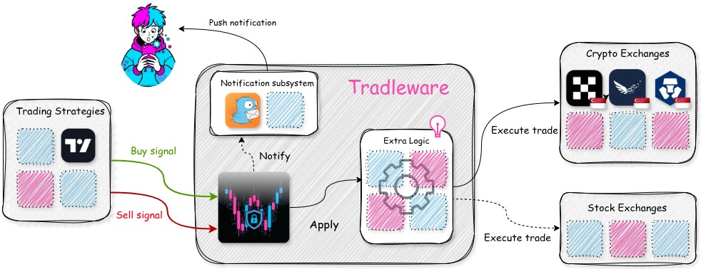

# TRADLEWARE

<p align="center">
  
</p>

<p align="center">
  
  
  
  
  
  
  
</p>


**Tradleware** is a **free, open-source autotrading middleware** that bridges the gap between your trading strategies and cryptocurrency/stock exchanges—built with **privacy-and-security-by-design** from Singapore 🇸🇬 with love (with a Hungarian researcher's obsession with efficiency, paprika-level debugging, and the belief that if it's worth automating, it's worth over-engineering at 3 AM with coffee ☕🇭🇺).

## High-level Architecture of Tradleware
<p align="center">
  
</p>

Take full control of your automated trading without compromising your security. Tradleware runs entirely on **your own infrastructure**, meaning your exchange API keys never leave your servers. No third-party services. No data sharing. No subscription fees. Just you, your strategies, and your trades.

Designed to capture webhooks from popular strategy platforms like **TradingView**, Tradleware validates, processes, and executes trades automatically on exchanges that meet Singapore's rigorous regulatory standards. While my focus is on exchanges approved or being approved by the **Monetary Authority of Singapore (MAS)**—ensuring they've passed through stringent vetting processes—Tradleware can be used anywhere in the world. I simply believe in building on platforms that prioritize compliance, security, and trader protection.

**Key Philosophy:**
- 🔒 **Privacy First**: Your API keys, your data, your control
- 💰 **Completely Free**: No hidden costs, no subscriptions, free forever (How ah? coz how i charge u if you run it at home ah??)
- 🤖 **Automation Done Right**: Secure webhook processing with built-in safety checks
- 🏛️ **Regulatory Focus**: Prioritizing MAS-compliant exchanges for peace of mind
- 🌏 **Global Ready**: Use it anywhere, with any supported exchange

Whether you're running sophisticated algorithmic strategies or simple indicator-based alerts, Tradleware ensures your trades execute reliably, securely, and automatically—all while keeping your sensitive data exactly where it belongs: with you.

---

## Features

- **Multi-Exchange Support**: OKX, Independent Reserve, Crypto.com, and IBKR (extensible for other exchanges/brokers)
- **YAML Bot Config**: Each bot is configured via a simple YAML file — no env var juggling, no naming conventions to memorize
- **Web UI**: FastAPI-based web interface for monitoring and controlling trading bots
- **Real-time Logging**: Color-coded logs with real-time updates in the web interface
- **Webhook Integration**: Secure webhook endpoints for automated trading signals
- **Gotify Notifications**: Real-time push notifications for trading events
- **Convert Functionality**: Automatic fiat to stablecoin conversion


## Docker Deployment

The easiest way to run Tradleware is using Docker. You have two options:

### Option 1: Pull Pre-built Image from Docker Hub (Recommended)

The fastest way to get started - no compilation needed! Just pull the official image (latest for `amd64`):

```bash
docker pull cslev/tradleware:latest
```
For different versions and architectures, visit [Dockerhub](https://hub.docker.com/repository/docker/cslev/tradleware/tags).

Then run using docker-compose (see [Configure Environment Variables](#configure-environment-variables) section below first):

```bash
docker-compose up -d
```

**Benefits:**
- ⚡ No build time - instant deployment
- ✅ Pre-tested stable release
- 🔄 Easy updates with `docker pull cslev/tradleware:latest`

### Option 2: Build from Source

If you prefer to build locally or want to modify the code:

Navigate to the project root and build the image:

```bash
cd /path/to/tradleware
docker-compose build
```

This will:
- Use Python 3.11 slim image as the base
- Install all dependencies from `src/requirement.txt`
- Set up the application with proper permissions
- Configure health checks for monitoring

### Configure Bot Settings

Tradleware uses **two separate config layers**:

- **`bot_configs/`** — per-exchange YAML files holding API keys, trading pairs, and bot IDs (gitignored, stays on your server)
- **`.env`** — Tradleware-level settings only (dashboard auth, webhook path, logging, Gotify)

#### Step 1 — Set up your bot YAML files

Copy the example files and fill in your credentials:

```bash
# Crypto exchanges
cp bot_configs/crypto/okx.yaml.example      bot_configs/crypto/okx.yaml
cp bot_configs/crypto/cryptocom.yaml.example bot_configs/crypto/cryptocom.yaml
cp bot_configs/crypto/ir.yaml.example        bot_configs/crypto/ir.yaml

# Stock brokers
cp bot_configs/stock/ibkr.yaml.example bot_configs/stock/ibkr.yaml
```

Each YAML file follows this structure (example: `bot_configs/crypto/okx.yaml`):

```yaml
bots:
  - id: mybtcbot              # lowercase — used as trader_id in webhook payloads
    api_key: your_okx_api_key
    secret_key: your_okx_secret_key
    passphrase: your_okx_passphrase
    subaccount_name: MySubaccount
    hostname: my.okx.com
    stablecoin_fiat_pair: USDT/SGD
    crypto_stablecoin_pair: BTC/USDT
    tradleware_api_key: your_webhook_auth_key  # openssl rand -hex 32
```

For the IBKR broker, `bot_configs/stock/ibkr.yaml` has a shared `gateway` block plus a `bots` list — see `ibkr.yaml.example` for the full structure.

You only need the YAML files for the exchanges you actually use. Unused files can be left out entirely.

#### Step 2 — Set up `.env`

The `.env` file contains **only Tradleware-level settings** — no bot secrets:

```bash
cp .env.example .env
```

#### `.env` Reference

| Variable | Required | Default | Description |
|----------|----------|---------|-------------|
| **Dashboard & Security** |
| `DASHBOARD_USERNAME` | No | `admin` | Username for dashboard login |
| `DASHBOARD_PASSWORD` | No | `changeme` | Password for dashboard login (⚠️ **Change this!**) |
| `SESSION_SECRET_KEY` | No | Auto-generated | Secret key for session encryption. Generate with `openssl rand -hex 32` |
| `WEBHOOK_PATH` | No | `webhook` | Custom webhook endpoint path for security (e.g., `ka8Moh4aiNgai4`). Generate with `pwgen -n 14` |
| `TRUSTED_IPS` | No | - | Comma-separated IPs that bypass authentication (e.g., `127.0.0.1,192.168.1.100`) |
| **UI Configuration** |
| `LOG_REFRESH_INTERVAL_MS` | No | `5000` | Dashboard log refresh interval in milliseconds |
| **Logging** |
| `LOG_LEVEL` | No | `10` | Minimum log level (10=DEBUG, 20=INFO, 25=SUCCESS, 30=WARNING, 40=ERROR, 50=CRITICAL) |
| **Gotify Notifications** |
| `GOTIFY_SERVER_URL` | No | - | Your Gotify server URL (e.g., `https://gotify.example.com`) |
| `GOTIFY_APP_TOKEN` | No | - | Gotify application token for sending notifications |
| `GOTIFY_LOG_LEVEL` | No | `30` | Minimum log level for Gotify notifications |

#### Quick Setup

1. **Copy and fill in your bot YAML file(s)**:
   ```bash
   cp bot_configs/crypto/okx.yaml.example bot_configs/crypto/okx.yaml
   # edit bot_configs/crypto/okx.yaml with your real API keys
   ```

2. **Copy and configure `.env`**:
   ```bash
   cp .env.example .env
   ```

3. **Configure dashboard security** in `.env`:
   ```env
   DASHBOARD_USERNAME="yourusername"
   DASHBOARD_PASSWORD="your-secure-password"
   
   # Generate random webhook path for security (use: pwgen -n 14)
   WEBHOOK_PATH="ka8Moh4aiNgai4"
   
   # Optional: Generate session secret (use: openssl rand -hex 32)
   SESSION_SECRET_KEY="your-generated-session-secret"
   ```

4. **Optional: Configure Gotify notifications** in `.env`:
   ```env
   GOTIFY_SERVER_URL="https://your-gotify-server.com"
   GOTIFY_APP_TOKEN="your-gotify-token"
   GOTIFY_LOG_LEVEL=30
   ```

### Run the Container

After building, start the container:

```bash
docker-compose up -d
```

The application will be available at `http://localhost:8080`

```

### View Logs

Check the application logs:

```bash
docker-compose logs -f tradleware
```

### Stop the Container

```bash
docker-compose down
```

### Rebuild After Changes

If you make changes to the code or `.env` file:

```bash
docker-compose down
docker-compose build --no-cache
docker-compose up -d
```

**Note:** The `docker-compose.yml` mounts `./tradleware_data/logs` (to persist logs) and `./bot_configs` (read-only, so your YAML config files are available inside the container) — both survive container restarts.

## Gotify Integration

Tradleware supports real-time push notifications via Gotify for important trading events.

### Setup Gotify Notifications

1. **Install Gotify Server** (if you don't have one):
   ```bash
   # Using Docker
   docker run -p 80:80 gotify/server
   ```

2. **Configure Environment Variables**:
   Add these to your `.env` file:
   ```env
   GOTIFY_SERVER_URL=https://your-gotify-server.com
   GOTIFY_APP_TOKEN=your_app_token_here
   GOTIFY_LOG_LEVEL=30
   ```

## Webhook Security Configuration

Tradleware supports configurable webhook endpoints to protect against DDoS attacks and unauthorized access attempts. By default, webhooks are accessible at `/webhook`, but you can customize this to any random or meaningful path.

### Why Configure a Custom Webhook Path?

**Security Benefits:**
- **Obscurity**: Random webhook paths make it harder for attackers to discover your endpoint
- **DDoS Protection**: Without knowing the path, automated bots cannot target your webhook with spam requests
- **Brute Force Prevention**: Reduces the attack surface by making the endpoint URL unpredictable
- **No Code Changes**: You can change the path anytime by just updating the `.env` file

### How to Configure

1. **Generate a Random Webhook Path** (Recommended):
   ```bash
   # Generate a 14-character random string
   pwgen -n 14
   # Example output: ka8Moh4aiNgai4
   ```

2. **Add to `.env` file**:
   ```env
   # Default (less secure)
   WEBHOOK_PATH=webhook
   
   # Recommended: Use a random string
   WEBHOOK_PATH=ka8Moh4aiNgai4
   
   # Or use a custom meaningful path
   WEBHOOK_PATH=my-trading-signals-2024
   ```

3. **Update TradingView Webhook URL**:
   After changing the path, update your TradingView alerts to use the new webhook URL:
   ```
   https://your-tradleware-domain.com/ka8Moh4aiNgai4
   ```

### Webhook Endpoint Details

**Default Endpoint:**
- URL: `https://your-domain.com/webhook`
- Easy to guess, vulnerable to scanning

**Secured Endpoint (Example):**
- URL: `https://your-domain.com/ka8Moh4aiNgai4`
- Nearly impossible to guess, protected from random attacks

The webhook path is displayed in:
- The web UI on each trading bot card
- The footer of the dashboard
- The cURL test examples

**Note:** The webhook still requires API key authentication, so even if someone discovers the URL, they cannot execute trades without the correct `tradleware_api_key` configured in the bot's YAML file.


---
---
## DEV: Run and debug

Navigate to project root
```
cd /path/to/tradleware
```

Activate virtual environment
```
source .venv/bin/activate
```

Install dependencies
```
pip install -r src/requirement.txt
```

Start Tailwind CSS watcher (in separate terminal)
```
cd src/ui
npx tailwindcss -i ./static/css/input.css -o ./static/css/output.css --watch
```

Run FastAPI app (in main terminal) from project root
```
uvicorn src.ui.app:app --host 0.0.0.0 --port 8080 --reload
```