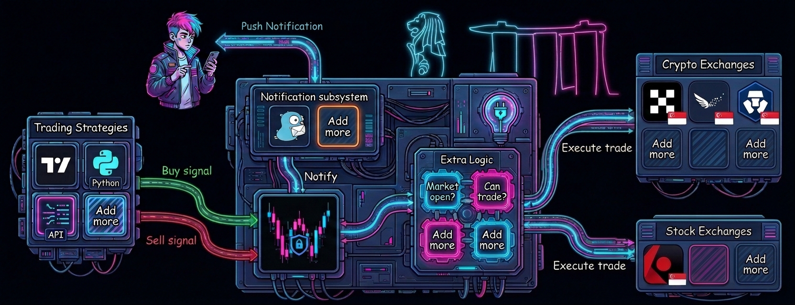

# 🛡️ Tradleware: The Sovereign Trading Appliance

<p align="center">
  
</p>

<p align="center">
  
  
  
  
  
  
  
</p>


## Own your infrastructure. Own your alpha.

Tradleware (*/ˈtreɪ.dəl.wɛər/*) is a free, open-source autotrading middleware that bridges the gap between your trading strategies and the world’s most regulated exchanges. Tradleware is **Security-by-Design**, born from a unique intersection of two worlds:

- Built in Singapore 🇸🇬: Tailored for the world’s most rigorous regulatory environment.
- Hungarian Engineering 🇭🇺: Forged with the obsessive precision of a PhD in Computer Science and the "Zero-Trust" mindset of a Cybersecurity Researcher.

If a system isn't hardened, audited, and optimized for 24/7 reliability, it isn't worth running. 

**Tradleware** isn't just a script; it’s a high-performance engine for traders who treat their capital like a mission-critical asset.

## Why Tradleware?
Most "trading bridges" are black boxes in the cloud that demand your API keys and a monthly subscription. Tradleware is different. It is a Sovereign Appliance designed to run on a Raspberry Pi or your home lab.

The "dle" in Tradleware stands for Cradle: our mission is to cradle your sensitive credentials and logic safely within your own network. Your keys never leave your sight. No third-party services. No data harvesting. No "subscription tax." Just raw, private execution.


## 🛠️ High-Level Architecture
Tradleware acts as the hardened "Switchboard" between your signals and the market:
1.  **Ingress:** Listen on an unpredictable, custom webhook path for JSON signals.
2.  **Validation:** Verify signals against local, YAML-defined bot configurations.
3.  **Processing:** Apply custom logic (sizing, fractional checks, fiat-to-stablecoin conversion).
4.  **Execution:** Secure, local dispatch to the Exchange/Broker API.
<p align="center">
  
</p>

## 🏛️ The Singapore Advantage (MAS-Regulated)
**Tradleware** is engineered for the Monetary Authority of Singapore (MAS) regulatory framework. Eschewing offshore "ghost" exchanges, it provides native, high-performance execution for Major Payment Institution (MPI) licensed platforms including Interactive Brokers (IBKR) for professional-grade TradFi, Independent Reserve for institutional crypto-fiat rails, and OKX and Crypto.com for liquid, fully-licensed spot markets.

## 🚀 Key Features

### **🔒 Maximum Operational Security**
* **Zero-Trust Architecture:** 100% on-premise. Your API keys never leave your network.
* **The "Cradle" Concept:** Designed to cradle your private credentials safely within your own infrastructure, protecting them from third-party "black box" vulnerabilities.
* **Webhook Hardening:** Custom endpoints (e.g., changing `/webhook` to an unpredictable path) via `.env` to stay invisible to scanners and block DDoS/Spam bots.
* **Trusted IP Auto-Login:** Optimized for keyboard/mouse-less Raspberry Pi setups—auto-login from your trusted home subnet only.
* **E2E Visibility:** Persistent dashboard indicators confirm your session is encrypted end-to-end.

### **📉 Precision Execution & Logic**

* **Hybrid Trade Sizing:** Support for both **Percentage-based** and **Fixed Quantity** trading—essential for traditional stocks that do not support fractional shares.
* **Conflict-Free ROI:** Tradleware is broker-agnostic. It executes *your* logic, not an exchange's "AI bot" designed to farm transaction fees.
* **The "USB-C" of Trading:** Pluggable and extensible. Are you a developer? Inject custom Python logic *after* a signal arrives but *before* it hits the exchange.

### **🌱 Efficiency & Sustainability**
* **The 15W Trading Desk:** Specifically tuned for ARM/Raspberry Pi. Run 24/7 with a carbon footprint smaller than a household lightbulb.
* **Docker-First:** One-command deployment for both the middleware and the IBKR Gateway.
* **Real-time Monitoring:** FastAPI Web UI with color-coded logs and **Gotify** push notifications.


## 💰 Why Free?
"How I charge you if you run it at home ah?" 🇸🇬  

Tradleware is open-source because financial sovereignty shouldn't have a middleman tax. If you find value in the research, feel free to contribute to the code or the project.

---

<p align="center">
  
</p>

## Getting Started

Tradleware runs from a pre-built Docker image — no compilation, no Python setup required. All you need is Docker, your exchange API keys, and the config template files.

### Step 1 — Get the deployment files

Clone the repo to get `docker-compose.yml` and all config templates. You won't touch the source code — this is just the quickest way to get everything in one step:

```bash
git clone --depth 1 https://github.com/cslev/tradleware
cd tradleware
```

> `--depth 1` fetches only the latest snapshot — no full git history, minimal download.

### Step 2 — Configure your bots

Tradleware uses two config layers:

- **`bot_configs/`** — per-exchange YAML files with API keys and bot settings (gitignored, stays on your server)
- **`.env`** — Tradleware-level settings only (dashboard auth, webhook path, logging, Gotify)

Copy only the example files for the exchanges you use:

```bash
# Crypto (copy only what you need)
cp bot_configs/crypto/okx.yaml.example       bot_configs/crypto/okx.yaml
cp bot_configs/crypto/cryptocom.yaml.example bot_configs/crypto/cryptocom.yaml
cp bot_configs/crypto/ir.yaml.example        bot_configs/crypto/ir.yaml

# Stock (IBKR) — also needs .env.ibkr for the gateway container credentials
cp bot_configs/stock/ibkr.yaml.example bot_configs/stock/ibkr.yaml
cp .env.ibkr.example                   .env.ibkr
```

Edit each file with your real credentials. Example structure for `bot_configs/crypto/okx.yaml`:

```yaml
bots:
  - id: mybtcbot              # lowercase — used as trader_id in webhook payloads
    api_key: your_okx_api_key
    secret_key: your_okx_secret_key
    passphrase: your_okx_passphrase
    subaccount_name: your_subaccount_name #always better to have a separate subaccount for trading strategies
    hostname: my.okx.com
    stablecoin_fiat_pair: USDT/SGD
    crypto_stablecoin_pair: BTC/USDT
    tradleware_api_key: your_webhook_auth_key  # openssl rand -hex 32
```

For IBKR, see `bot_configs/stock/ibkr.yaml.example` for the full structure and [IBKR_SETUP.md](IBKR_SETUP.md) for the gateway setup.

### Step 3 — Configure `.env`

```bash
cp .env.example .env
```

Minimum settings to change:

```env
DASHBOARD_USERNAME="yourusername"
DASHBOARD_PASSWORD="your-secure-password"

# Randomize the webhook path to protect against automated scans
# Generate with: pwgen -n 14
WEBHOOK_PATH="ka8Moh4aiNgai4"
```

#### Full `.env` reference

| Variable | Required | Default | Description |
|----------|----------|---------|-------------|
| `DASHBOARD_USERNAME` | No | `admin` | Dashboard login username |
| `DASHBOARD_PASSWORD` | No | `changeme` | Dashboard login password (⚠️ **Change this!**) |
| `SESSION_SECRET_KEY` | No | Auto-generated | Session encryption key — `openssl rand -hex 32` |
| `WEBHOOK_PATH` | No | `webhook` | Webhook URL path — randomize for security (`pwgen -n 14`) |
| `TRUSTED_IPS` | No | — | Comma-separated IPs that bypass authentication |
| `LOG_REFRESH_INTERVAL_MS` | No | `5000` | Dashboard log refresh interval (ms) |
| `LOG_LEVEL` | No | `10` | Min log level: 10=DEBUG, 20=INFO, 30=WARNING, 40=ERROR |
| `GOTIFY_SERVER_URL` | No | — | Gotify server URL for push notifications |
| `GOTIFY_APP_TOKEN` | No | — | Gotify application token |
| `GOTIFY_LOG_LEVEL` | No | `30` | Min log level for Gotify notifications |

### Step 4 — Run

```bash
docker-compose up -d
```

Docker pulls `cslev/tradleware:latest` automatically on first run. The dashboard will be available at `http://localhost:8080`.

> For different versions and architectures (including arm64 for Raspberry Pi), visit [Docker Hub](https://hub.docker.com/repository/docker/cslev/tradleware/tags).

### Updating to a new version

```bash
docker-compose down
docker-compose pull
docker-compose up -d
```

### View logs

```bash
docker-compose logs -f tradleware
```

### Stop

```bash
docker-compose down
```

**Note:** `docker-compose.yml` mounts `./tradleware_data/logs` (persistent logs) and `./bot_configs` (read-only config) — both survive container restarts.

> Want to build from source or contribute? See [BUILD.md](BUILD.md).

## Gotify Integration

Tradleware supports real-time push notifications via Gotify for important trading events and critical errors — so you never miss a trade execution, a failed order, or anything that needs your attention, even when you're away from the dashboard.

### Setup Gotify Notifications

1. **Install Gotify Server** (if you don't have one):
   ```bash
   # Using Docker
   docker run -p 80:80 gotify/server
   ```

2. **Configure Environment Variables**:
   Add these to your Tradleware's `.env` file:
   ```env
   GOTIFY_SERVER_URL=https://your-gotify-server.com
   GOTIFY_APP_TOKEN=your_app_token_here
   GOTIFY_LOG_LEVEL=30
   ```

## Webhook Security Configuration

Tradleware supports configurable webhook endpoints to protect against DDoS attacks and unauthorized access attempts. By default, webhooks are accessible at `/webhook`, but you can customize this to any random or meaningful path.

### Why Configure a Custom Webhook Path?

**Security Benefits:**
- **Obscurity**: Random webhook paths make it harder for attackers to discover your endpoint
- **DDoS Protection**: Without knowing the path, automated bots cannot target your webhook with spam requests
- **Brute Force Prevention**: Reduces the attack surface by making the endpoint URL unpredictable
- **No Code Changes**: You can change the path anytime by just updating the `.env` file

### How to Configure

1. **Generate a Random Webhook Path** (Recommended):
   ```bash
   # Generate a 14-character random string
   pwgen -n 14
   # Example output: ka8Moh4aiNgai4
   ```

2. **Add to `.env` file**:
   ```env
   # Default (less secure)
   WEBHOOK_PATH=webhook
   
   # Recommended: Use a random string
   WEBHOOK_PATH=ka8Moh4aiNgai4
   
   # Or use a custom meaningful path
   WEBHOOK_PATH=my-trading-signals-2024
   ```

3. **Update TradingView Webhook URL**:
   After changing the path, update your TradingView alerts to use the new webhook URL:
   ```
   https://your-tradleware-domain.com/ka8Moh4aiNgai4
   ```

### Webhook Endpoint Details

**Default Endpoint:**
- URL: `https://your-domain.com/webhook`
- Easy to guess, vulnerable to scanning

**Secured Endpoint (Example):**
- URL: `https://your-domain.com/webhook-ka8Moh4aiNgai4`
- Nearly impossible to guess, protected from random attacks

The webhook path is displayed in:
- The web UI on each trading bot card
- The footer of the dashboard
- The cURL test examples

**Note:** The webhook still requires API key authentication, so even if someone discovers the URL, they cannot execute trades without the correct `tradleware_api_key` configured in the bot's YAML file. Moreover, each bot has different keys, thereby limiting further the impact of any small information being compromised.

### Webhook Payload

Every webhook request must be a `POST` with a JSON body. Here's a full example:

```json
{
  "api_key":         "your_tradleware_api_key",
  "trader_id":       "mybtcbot",
  "ticker":          "BTC/USDT",
  "action":          "buy",
  "timestamp":       "2026-03-28T12:00:00Z",
  "alert_name":      "Supertrend Buy Signal",
  "order_size":      100,
  "order_size_type": "percentage",
  "dry_run":         false
}
```

Key fields:

| Field | Required | Description |
|-------|----------|-------------|
| `api_key` | Yes | The `tradleware_api_key` from the bot's YAML config |
| `trader_id` | Yes | The `id` field from the bot's YAML config (lowercase) |
| `ticker` | Yes | Must match the bot's configured `crypto_stablecoin_pair` exactly |
| `action` | Yes | `buy` or `sell` |
| `timestamp` | Yes | Unix timestamp (seconds or ms) or ISO 8601 string |
| `order_size` | Yes | Amount to trade — percentage (0–100) or exact quantity depending on `order_size_type` |
| `order_size_type` | No | `percentage` (default) or `quantity` |
| `alert_name` | No | Optional label shown in logs and notifications |
| `dry_run` | No | `true` to simulate without executing — useful for testing |

> **Tip:** Each bot's dashboard card has a **Webhook Details** pane showing the exact endpoint URL, a ready-to-use cURL example, and a live test button — the easiest way to verify your setup without leaving the UI.

