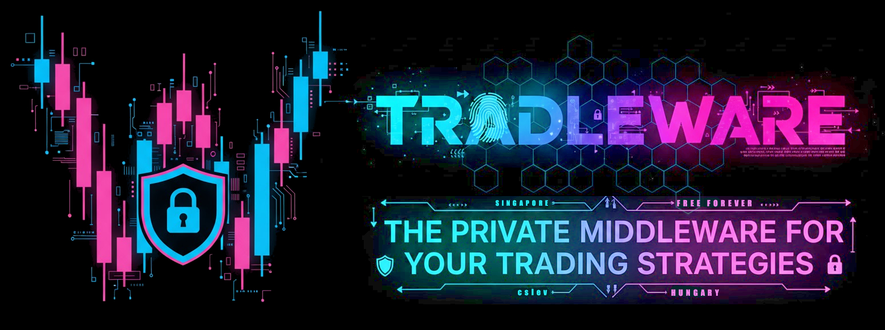
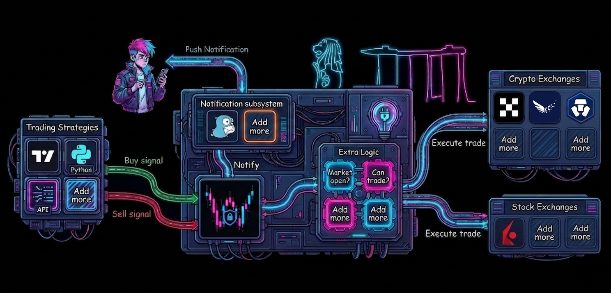
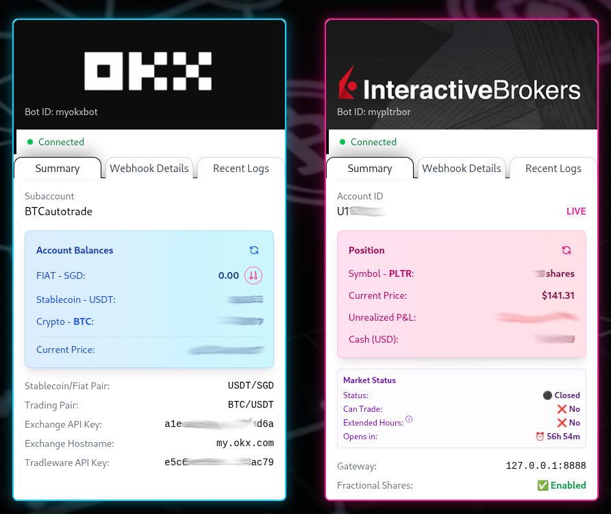

# Tradleware: The Sovereign Trading Appliance

<p align="center">
  
</p>

<p align="center">
  <a href="https://tradleware.com"></a>
  
  
  
  <a href="https://hub.docker.com/r/cslev/tradleware"></a>
  <a href="https://hub.docker.com/r/cslev/tradleware"></a>
  
  
  
</p>


> 🌐 **Project website:** [tradleware.com](https://tradleware.com)

## Own your infrastructure. Own your alpha.

Tradleware (*/ˈtreɪ.dəl.wɛər/*) is a free, open-source autotrading middleware that bridges the gap between your trading strategies and the world’s most regulated exchanges. Tradleware is **Security-by-Design**, born from a unique intersection of two worlds:

- PhD-level Engineering: Forged with the obsessive precision of a PhD in Computer Science and the "Zero-Trust" mindset of a Cybersecurity Researcher.
- Built for the global community: Designed to run anywhere, on any hardware, for any trader who values privacy and control.

If a system isn't hardened, audited, and optimized for 24/7 reliability, it isn't worth running. 

**Tradleware** isn't just a script; it’s a high-performance engine for traders who treat their capital like a mission-critical asset.

## Why Tradleware?
Most "trading bridges" are black boxes in the cloud that demand your API keys and a monthly subscription. Tradleware is different. It is a Sovereign Appliance designed to run on a Raspberry Pi or your home lab.

The "dle" in Tradleware stands for Cradle: our mission is to cradle your sensitive credentials and logic safely within your own network. Your keys never leave your sight. No third-party services. No data harvesting. No "subscription tax." Just raw, private execution.


## High-Level Architecture
Tradleware acts as the hardened "Switchboard" between your signals and the market:
1.  **Ingress:** Listen on an unpredictable, custom webhook path for JSON signals.
2.  **Validation:** Verify signals against local, YAML-defined bot configurations.
3.  **Processing:** Apply custom logic (sizing, fractional checks, fiat-to-stablecoin conversion).
4.  **Execution:** Secure, local dispatch to the Exchange/Broker API.
<p align="center">
  
</p>

## Industry-Standard Licensed Exchanges
**Tradleware** is built for regulated, industry-standard exchanges — eschewing offshore "ghost" exchanges in favour of fully-licensed platforms. It provides native, high-performance execution for Interactive Brokers (IBKR) for professional-grade TradFi, Independent Reserve for institutional crypto-fiat rails, and OKX, Crypto.com, Coinbase, Kraken, and Binance for liquid, fully-licensed spot markets.

| Exchange | Type | Regulated | MAS Approved |
|---|---|---|---|
| OKX | Crypto | ✅ | ✅ |
| Independent Reserve | Crypto | ✅ | ✅ |
| Crypto.com | Crypto | ✅ | ✅ |
| Coinbase | Crypto | ✅ | ✅ |
| Kraken | Crypto | ✅ | ❌ |
| Binance | Crypto | ✅ | ❌ |
| Interactive Brokers (IBKR) | Stock / TradFi | ✅ | ✅ |

> MAS = Monetary Authority of Singapore. All exchanges with ✅ hold or have received a Major Payment Institution (MPI) or Capital Markets Services (CMS) licence from MAS.

## Key Features

### Maximum Operational Security
* **Zero-Trust Architecture:** 100% on-premise. Your API keys never leave your network.
* **The "Cradle" Concept:** Designed to cradle your private credentials safely within your own infrastructure, protecting them from third-party "black box" vulnerabilities.
* **Webhook Hardening:** Custom endpoints (e.g., changing `/webhook` to an unpredictable path) via `.env` to stay invisible to scanners and block DDoS/Spam bots.
* **Trusted IP Auto-Login:** Optimized for keyboard/mouse-less Raspberry Pi setups—auto-login from your trusted home subnet only.
* **E2E Visibility:** Persistent dashboard indicators confirm your session is encrypted end-to-end.

### Precision Execution & Logic

* **Hybrid Trade Sizing:** Support for both **Percentage-based** and **Fixed Quantity** trading—essential for traditional stocks that do not support fractional shares.
* **Conflict-Free ROI:** Tradleware is broker-agnostic. It executes *your* logic, not an exchange's "AI bot" designed to farm transaction fees.
* **The "USB-C" of Trading:** Pluggable and extensible. Are you a developer? Inject custom Python logic *after* a signal arrives but *before* it hits the exchange.

### Efficiency & Sustainability
* **The 15W Trading Desk:** Specifically tuned for ARM/Raspberry Pi. Run 24/7 with a carbon footprint smaller than a household lightbulb.
* **Docker-First:** One-command deployment for both the middleware and the IBKR Gateway.
* **Real-time Monitoring:** FastAPI Web UI with color-coded logs and **Gotify** push notifications.


## Why Free?
Tradleware is a personal, open-source hobby project provided free to the developer community. It is not a commercial service or a business enterprise — if you run it on your own hardware, there's nothing to charge you for.

Financial sovereignty shouldn't have a middleman tax. If you find value in it, feel free to contribute to the code or the project.

---

<p align="center">
  
</p>

## Documentation

| | |
|---|---|
| **[Getting Started](GETTING_STARTED.md)** | Install, configure your bots, run, update, and run the tests |
| **[Webhooks](WEBHOOKS.md)** | Endpoint, payload schema, and the security requirements signals must meet |
| **[IBKR Setup](IBKR_SETUP.md)** | Interactive Brokers gateway configuration |
| **[Building](BUILD.md)** | Building the Docker image and developing locally |
| **[Changelog](CHANGELOG.md)** | Release history |

> **Upgrading from v3.3.x?** [v3.4.0b](CHANGELOG.md) has three breaking changes — most
> importantly, TradingView alerts must now send `{{timenow}}` instead of `{{time}}`.

---

## Quick start

```bash
git clone --depth 1 https://github.com/cslev/tradleware
cd tradleware
cp .env.example .env                                    # set your dashboard password and webhook path
cp bot_configs/crypto/okx.yaml.example bot_configs/crypto/okx.yaml   # and your exchange keys
docker-compose up -d
```

The dashboard is then at `http://localhost:8080`. Full walkthrough in
**[Getting Started](GETTING_STARTED.md)**.
